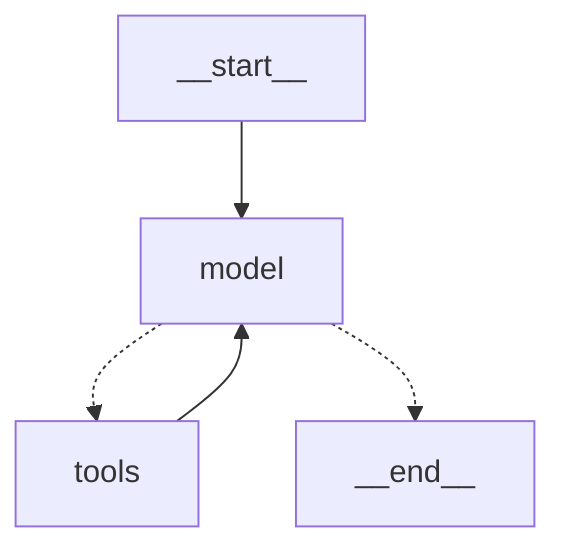

# DAY 1 : THE GRAPH BY HAND :

The week 1 project "toolbelt" was made using langchain framework along with the help of one langgraph component "create_agent", which was alreadya graph.I just didnot write it.
This week I will be writting the graph by myself, and also add 2 more features to our "toolbelt" : HITL ( ask the user before any tool call ), and keep the memory across restarts 
( which was not possible in week1's cli because of inMemorysaver() ).

To compare the graph, I will be askig the same questions that were being asked to week1's cli , to compare if my graph is working as it should be or not.

# STATE, NODES, EDGES :

The state I used is a `TypedDict` with one key, `messages`. The `Annotated[..., add_messages]` part is called a reducer, it tells LangGraph how to merge
what a node returns into the existing state ( here "append" ). So a node is a plain python function, state in, dict of changes out. It does not return
the whole state, only the new messages, and the reducer does the merging.

```python
class State(TypedDict):
    messages: Annotated[list[AnyMessage], add_messages]


def route(state: State) -> str:
    return "tools" if state["messages"][-1].tool_calls else END


builder = StateGraph(State)
builder.add_node("model", call_model)
builder.add_node("tools", run_tools)
builder.add_edge(START, "model")
builder.add_conditional_edges("model", route, ["tools", END])
builder.add_edge("tools", "model")
graph = builder.compile()
```

The graph I made had 2 nodes,model node and tool node. The model node is our llm binded with tools, with the system prompt appended. So system prompt is not stored in the State.
The tool node is a funtion which looks for all the available tools by name, run it, and returns a 'ToolMessage' with the request's 'tool_call_id'.I also used one conditional edge:
if the last message from model node has tool calls,go to tolls, otherwise 'END'. `START` and `END` are just the strings "__start__"` and `"__end__"`. Features like 'invoke`, `stream`
and `recursion_limit`,etc  work exactly the same.


# EXPERIMENT :

`graph.get_graph().draw_mermaid()` prints the graph as a Mermaid diagram, no network needed. Dotted arrows are the conditional edge.



Last week I streamed with `stream_mode="values"`, which gives the whole state after every step. This time I used `"updates"`, which gives one dict
per node run, `{node_name: changes}`. So the trace reads as a path : model, tools, model, tools, model. Two tool calls, then the answer.


# TAKEAWAYS :
- The message list is still the interface all the way down. Nodes only add to it.
- Nothing above the graph changed, so the checkpointer and `recursion_limit` from last week carry over as they are.

