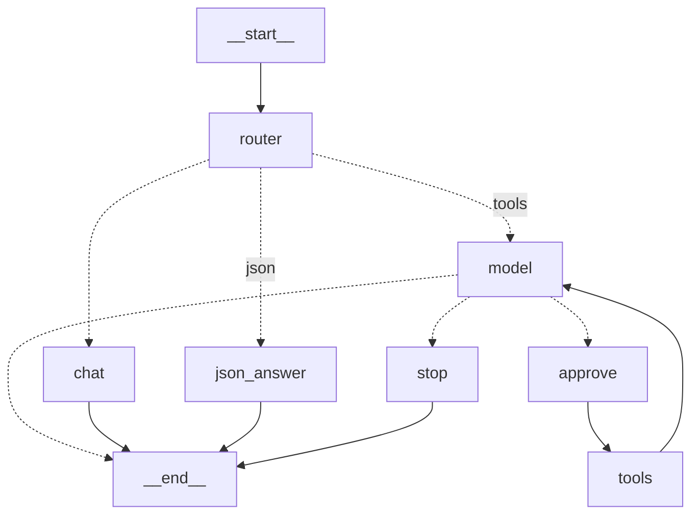

# Week 3, Day 2 (Tue): the client, and the price is async

Today we will make sure that tools are getting discovered at startuo instead of getting imported, and also 
our llm can access these tools. We will be asking ame questions as last week to compare if tools are actually working or not.

## Concepts takeaways:
- `MultiServerMCPClient({...})` takes a dict of server configs, `await client.get_tools()`
  starts each server, asks tools/list, and returns LangChain tool objects.
  The command points at the SERVER venv's python: client and server are different processes, so
  they can run different Python versions.
- `build_graph(checkpointer, tools)`: the tools list is an argument no. 
  `llm.bind_tools(tools)` works unchanged on adapter tools.
- The async . An MCP tool call is inter-process I/O, so adapter tools only have `ainvoke`.
  That pulls async through everything: the model and tool nodes are `async def`, the script calls
  `await toolbelt.ainvoke(...)`, and the top level is `asyncio.run(main())`. Sync-only nodes
  (stop, the edge functions) stay plain functions, and LangGraph mixes both.
- An MCP tool returns a LIST of content blocks (`[{"type": "text", "text": "2", ...}]`),so I flattened
  the text blocks to a string so ToolMessages look exactly like week 2's.
  Model -> approve -> tools -> model; the pause decides, the tool node executes.

## What went wrong or took time
- `interrupt()` inside an async node crashed: "Called get_config outside of a runnable context".
  LangGraph passes the config to interrupt through contextvars, and on Python 3.10 they do not
  reach the node under `ainvoke` (week 2 never saw this: everything was sync `invoke`). Moving
  interrupt to a sync node did not help on 3.10 either (the executor call does not copy context).
  Fix: `uv python install 3.12` and rebuild `.venv-client` on it. Python version
  is part of the harness requirement now.

